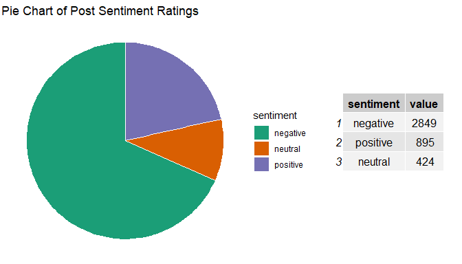
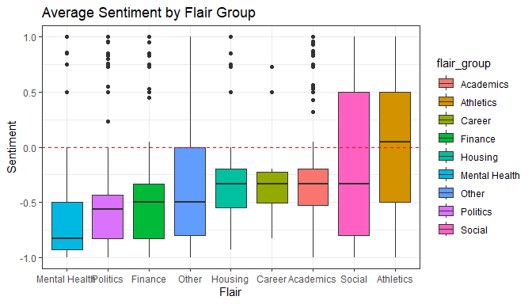

# UC Subreddit Analysis
Christopher Chen and Sean Saito
2025-10-16

This project aims to analyze the different micro-political climates
across campuses in the University of California system. We are using
data from Reddit, scraped using `.json` requests in Python.

## Exploratory Data Analysis

### Sentiment

Our data consists of post and comment data from the subreddits of all 9
UC campuses. This includes UC Berkeley, UCLA, UC Santa Barbara, UC
Davis, UC San Diego, UC Santa Cruz, UC Riverside, UC Irvine, and UC
Merced. Each subreddit was scraped for about 500 posts from the “Top”
posts in the last year. The data set we compiled will have 4189
observations with 9 variables. We have data on the upvotes/score on a
post, time created, and number of comments. Using LLMs, we measured the
sentiment of each post from negative to positive to neutral.

<details class="code-fold">
<summary>Show the code</summary>

``` r
sentiment_counts <- as.data.frame(table(UC_posts_data$rate_sentiment)) %>% 
  rename(value = Freq) %>% 
  rename(sentiment = Var1) %>% 
  arrange(desc(value))
pie <- ggplot(sentiment_counts, aes(x= "", y= value, fill = sentiment)) +  # SENTIMENT PIE
  geom_bar(stat="identity", width=1, col = "white") +
  coord_polar("y", start=0) +
  labs(title = "Pie Chart of Post Sentiment Ratings") +
  theme_void() +
  scale_fill_brewer(palette="Dark2") 

table <- tableGrob(sentiment_counts)
grid.arrange(pie, table, widths =c(2,1))
```

</details>



As to be expected from online platforms and social media, the majority
of posts created on the UC subreddits are negative in sentiment.

### Categories of Discussion

Using LLMs we were able to categorize each post by common topics of
college discussions. These include politics, housing, academics, and
more. Let’s take a look at the sentiment for each category.

<details class="code-fold">
<summary>Show the code</summary>

``` r
UC_flair_summary <- UC_posts_data %>% 
  group_by(flair_group) %>% 
  summarize("Mean Sentiment" = mean(post_sentiment), 
            "Negative" = sum(rate_sentiment == "negative"),
            "Neutral" = sum(rate_sentiment == "neutral"),
            "Positive" = sum(rate_sentiment == "positive"),
            "Total" = n()) %>% 
  arrange(desc(`Total`)) %>% 
  rename("Flair" = flair_group)
kable(UC_flair_summary)
```

</details>

| Flair         | Mean Sentiment | Negative | Neutral | Positive | Total |
|:--------------|---------------:|---------:|--------:|---------:|------:|
| Social        |     -0.1327946 |      605 |     113 |      402 |  1120 |
| Mental Health |     -0.5584869 |      614 |      37 |      111 |   762 |
| Politics      |     -0.5219763 |      612 |      81 |       66 |   759 |
| Academics     |     -0.2392090 |      359 |      75 |       97 |   531 |
| Finance       |     -0.4274755 |      406 |      34 |       71 |   511 |
| Athletics     |      0.1174038 |       72 |      33 |      103 |   208 |
| Other         |     -0.3308140 |      109 |      35 |       28 |   172 |
| Housing       |     -0.2883146 |       62 |      12 |       15 |    89 |
| Career        |     -0.2650000 |       10 |       4 |        2 |    16 |

<details class="code-fold">
<summary>Show the code</summary>

``` r
ggplot(UC_posts_data) +
  geom_boxplot(aes(x=reorder(flair_group, post_sentiment), post_sentiment, fill = flair_group)) + # sentiment by flair
  labs(title = "Average Sentiment by Flair Group", x = "Flair", y = "Sentiment") +
  geom_hline(yintercept = 0, col = "red", linetype = "dashed") +
  theme_bw()
```

</details>



#### Time

The subreddits also gave us UNIX time stamps for when each post and
comment was made. Using this, we can find the exact time a post was
created down to the millisecond. The response time of comments to a
particular post was calculated as well. Let’s see when the Top posts
were created:

<details class="code-fold">
<summary>Show the code</summary>

``` r
daily_counts <- UC_posts_data %>%
  count(date)
ggplot(daily_counts) +    # Times series for number of posts in time period
  geom_line(aes(x = date, y = n)) +
  labs(title = "Times Series of Post Counts", x = "Date", y = "Number of Posts") +
  scale_x_date(
    date_breaks = "2 month",  # Set breaks at every month
    date_labels = "%b %Y") +       # Format labels to show abbreviated month names (e.g., Jan, Feb)
  theme_bw()
```

</details>


We can observe an expected dip in activity during the summer months.
Let’s do the same for the comments in the time period that we were able
to scrape.

<details class="code-fold">
<summary>Show the code</summary>

``` r
UC_comments_time <- UC_comments %>% 
  mutate(timestamp = as.POSIXct(created_utc, origin = "1970-01-01", tz = "UTC")) %>% 
  mutate(date = as.Date(timestamp))
daily_counts <- UC_comments_time %>% 
  count(date)
ggplot(daily_counts) +    # Times series for number of comments in time period (that were able to be scraped)
  geom_line(aes(x = date, y = n)) +
  labs(title = "Times Series of Comment Counts", x = "Date", y = "Number of Comments") +
  scale_x_date(
    date_breaks = "2 month",  # Set breaks at every month
    date_labels = "%b %Y") +       # Format labels to show abbreviated month names (e.g., Jan, Feb)
  theme_bw()
```

</details>


#### College Rankings

According to a recent [University of California
article](https://www.universityofcalifornia.edu/news/university-of-california-best-public-university-2026-us-news-best-colleges-rankings),
the UC system is the best in the U.S. among public universities in 2026.
On September 22nd, the U.S. News & World Report released the 2026 Best
Colleges rankings, a list that they disseminate to help students compare
universities. UC Berkeley and UCLA are the top two public universities
in the country. The UCs are also recognized as top performers on social
mobility, with UC Riverside taking the Number 1 spot nationally. Using
the rankings by campus below, we can evenly split the 9 UC campuses into
3 different groups, high, middle, and low ranking.


We visualize how sentiment over different discussion topics varies
across college ranks.

<details class="code-fold">
<summary>Show the code</summary>

``` r
ggplot(rankings) +
  geom_point(aes(x=reorder(flair_group, - post_sentiment), y = post_sentiment, fill = rank, color = rank)) +
  geom_label(aes(x=reorder(flair_group, - post_sentiment), y = post_sentiment, color = rank, label = rank), size = 4) +
  labs(title = "Mean Sentiment by Category and UC Rankings", x = "Flair Group", y = "Sentiment") +
  coord_flip() +
  geom_hline(yintercept = 0, color = "red", linetype = "dotted", lwd = 1) +
  scale_color_brewer(palette = "Set1") +
  theme_bw()
```

</details>


Here we can observe that higher-ranked UC campuses tend to discuss more
positively across most categories, and lower-ranked campuses have more
negative sentiment.
