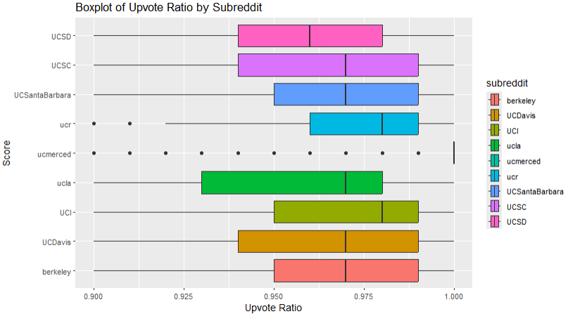
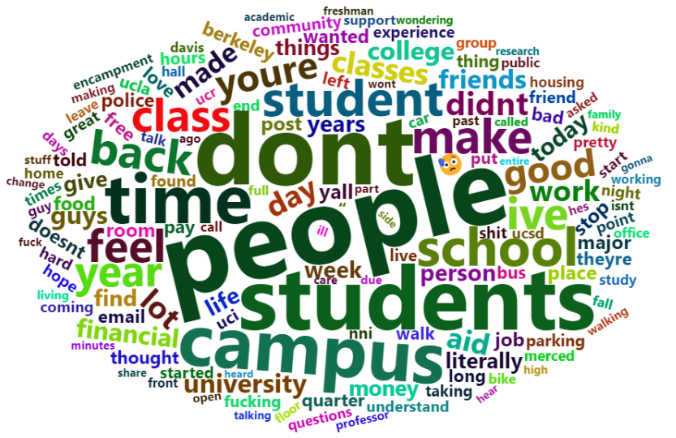
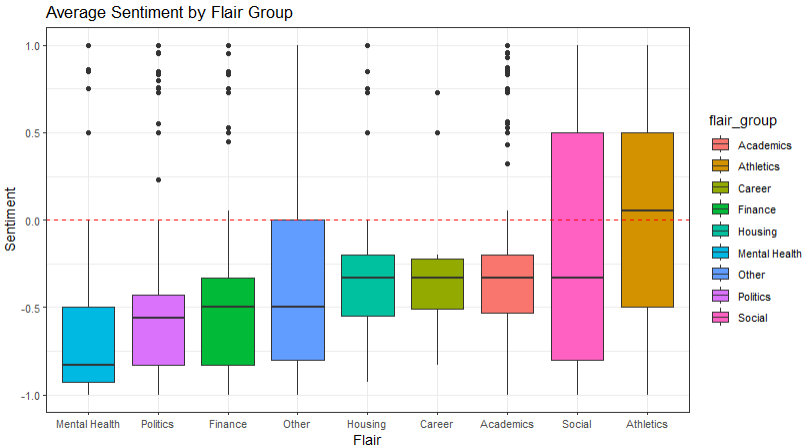
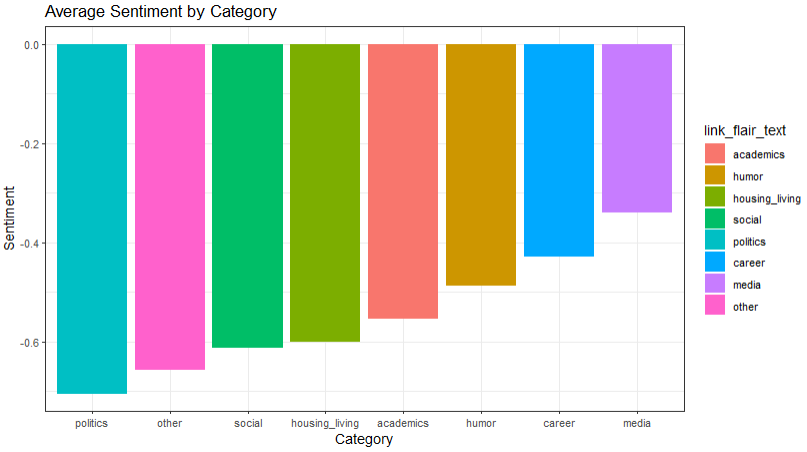
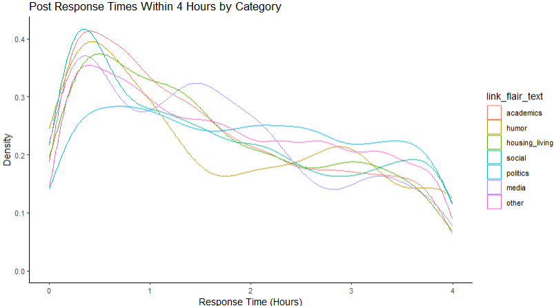
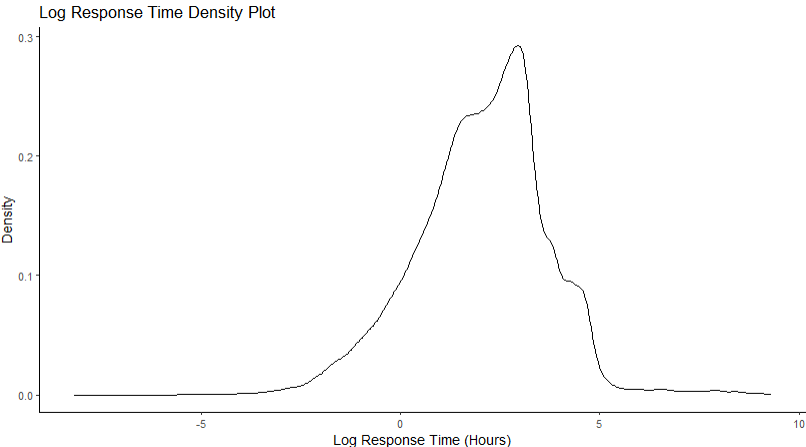
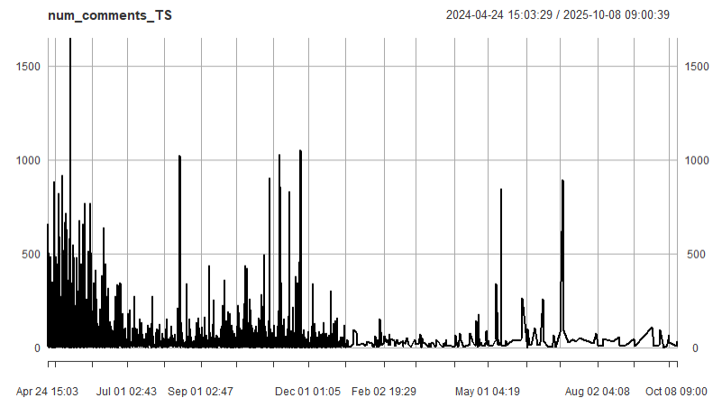
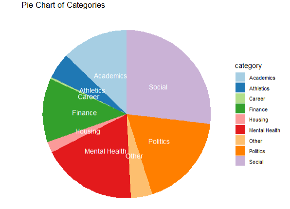
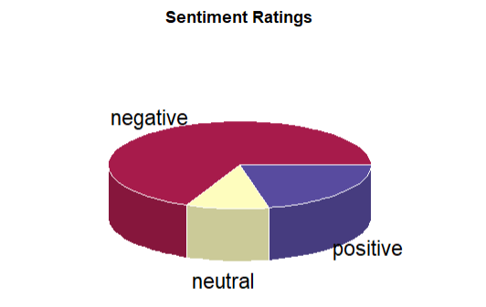

# UC Reddit Analysis
### Description
Analysis of micropolitical climates on UC campuses by using discussions on Reddit. Posts and comments from reddit were scraped into a dataset in order to explore the data and use LLMs for sentiment analysis. This project is still a work in progress. Working on it with Sean Saito.

  
  

### Early Visualizations

  
  
  
  
  
  
  
  
  
  

